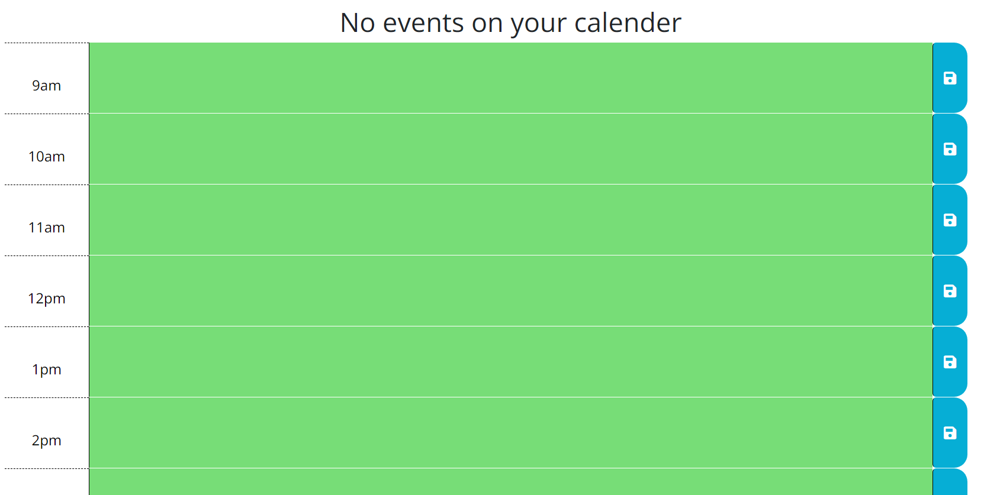

# Calender_App

## Description

This is a simple calender web app powered by Jquery, Vanilla JS and Moment.JS that allows users to schedule events for each hour of the day. The user is able to save events to localstorage as well as delete if desired.

Screenshot of the app

## Installation

N/A

## Usage

Check out the deployed application on https://iosazee.github.io/Calender_App/

## Credits

My teachers and mentors at Trilogy/EDx bootcamp.

